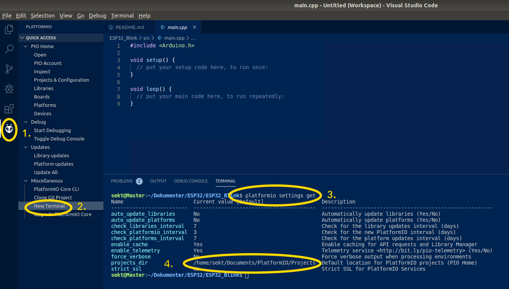
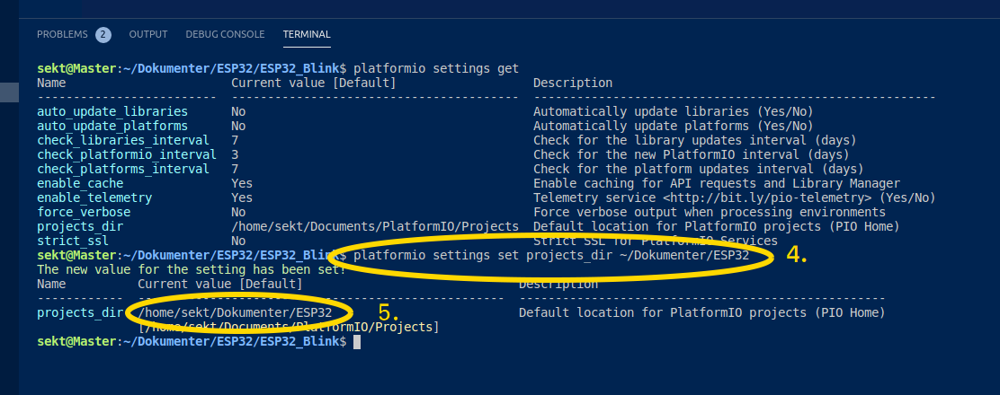
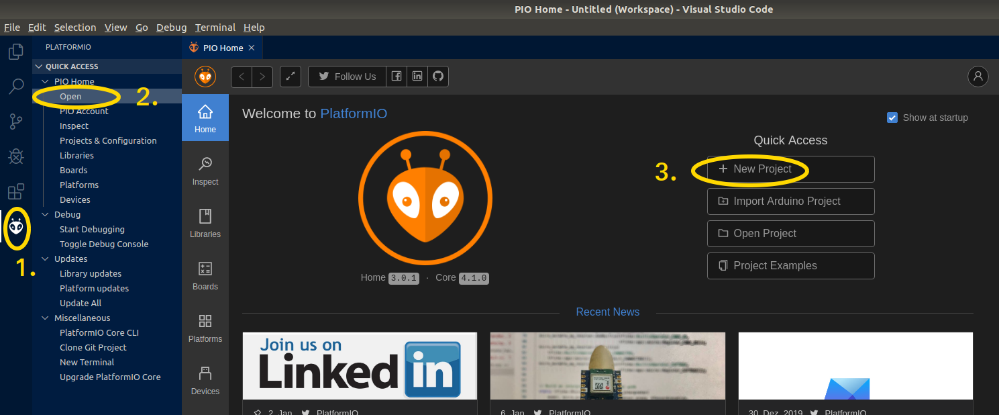
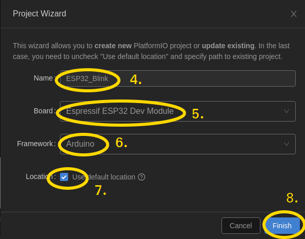

# 06 - Installation af Visual Studio Code med PlatformIO 

## VSC
* Åbn Firefox
  * Skriv adressen https://code.visualstudio.com/Download
    * Vælg Linux .deb - Debian, Ubuntu
      * Åbn med "Softwareinstallation()standard"
        * Klik "Installer"
          * Indtast password
            * Afslut Installer vindue når installation er færdig
              * Luk Firefox
* Klik Favoritter "Vis programmer"
  * søg efter "v"
    * Højreklik "Visual Studio ..."
      * Føj til favoritter
        * Tryk [ESC] og engan til [ESC]
* 
<hr/>  

# Installation af Visual Studio Code (VSC) & PlatformIO :
## Visual Studio Code
Klargør linux PlatformIO :
```bash
# installer python util for PlatformIO
sudo apt install -y python3-distutils
```
Video guide for installation af VSC & PlatformIO :
* [#264 PlatformIO for Arduino, ESP8266, and ESP32 Tutorial](https://www.youtube.com/watch?v=0poh_2rBq7E&list=PL3XBzmAj53RnZPeWe799F-uoXERBldhn9&index=38)  

[Klik her for at hente og installer Visual Studio Code](https://code.visualstudio.com/download)

  
*
  
*
  
*  
  
*  
  
*  

*
  
*
  
*
  
*
## PlatformIO :
### Installer PlatformIO fra VSC :
* Start VSC
* Åben Extensions med [Ctrl]+[Shift]+X
* Søg efter PlatformIO IDE 
* Tryk install og vent indtil installationen er afsluttet. 
* Genstart når det ønskes.

### Tilpas default settings :
[Klik for at se PlatformIO nyeste userguide](http://docs.platformio.org/en/latest/userguide/cmd_settings.html#projects-dir)  

  

  1. Klik på Platformio logo  
  2. Klik *New Terminal* under *Miscellaneous*
  3. indtast nu følgende linie i Terminal vinduet: 
```
platformio settings get
```
#### Ændre nu **projects_dir** til **~/Dokumenter/ESP32**
  

  4. indtast nu følgende linie i terminal vinduet:
```
platformio settings set projects_dir ~/Dokumenter/ESP32
```
  5. Se ændringen her.  
<hr/>  

# Start et nyt Project i PlatformIO - New Project :
## Open PlatformIO :
  

  1. Klik PlatformIO Icon  
  2. Klik Open  
  3. Klik New Project   
## Indtast Parameter for nyt project:
  

  4. Name: ESP32_Blink  
  5. Board: Espressif ESP32 Dev Module  
  6. Framework: Arduino  
  7. Location: Use default location  
  8. Tryk på [Finish] når alle felter er udfyldt.  
## Åben og juster *platformio.ini* tilhørende dit project :
  

  9. Åben filhontering  
  10. Åben Project ESP32_Blink  
  11. Åben filen platformio.ini  
  12. tilføj linien "monitor_speed=115200", den vil angiver den hastighed, der sendes og modtages data via vores serial port.  
  13. Gem nu ændringer med [CTRL]+S

<hr/>  
