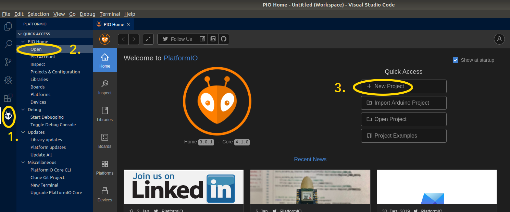
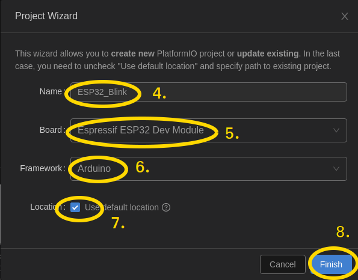
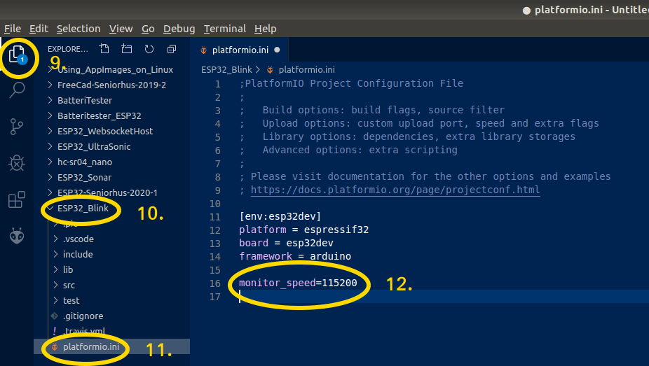

# 07 - Start et nyt Project i PlatformIO:
## Open PlatformIO :
  

  1. Klik PlatformIO Icon  
  2. Klik Open  
  3. Klik New Project   
## Indtast Parameter for nyt project:
  

  4. Name: ESP32_Blink  
  5. Board: Espressif ESP32 Dev Module  
  6. Framework: Arduino  
  7. Location: Use default location  
  8. Tryk på [Finish] når alle felter er udfyldt.  
## Åben og juster *platformio.ini* tilhørende dit project :
  

  9. Åben filhontering  
  10. Åben Project ESP32_Blink  
  11. Åben filen platformio.ini  
  12. tilføj linien "monitor_speed=115200", den vil angiver den hastighed, der sendes og modtages data via vores serial port.  
  13. Gem nu ændringer med [CTRL]+S
